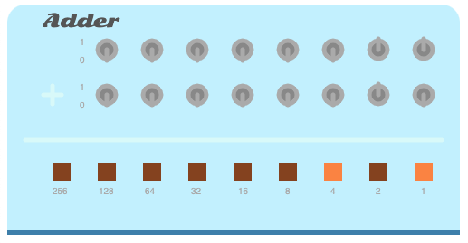

# blinkenlichten
an 8-bit binary adder in JS canvas.

## Plan 

building the front panel of an 8-bit binary adding machine like the one described early in Charles Petzold's book _Code_.
Ultimate idea is to build each of the little constructs in the book until I get an ALU. Also reading _Inside the Machine_.
**The JS is ES5! So no class keyword. I love ES5. Just in case anyone from the future finds this and is wondering what the
heck?!**

## Try it out!
try out the adder at:
http://www.arkidsinfo.com/adder/

I ended up making it look like an antique. Why? I have no clue.

## Notes
app.js is commented as well as I can muster right now. I really love Canvas and JS. Can't wait to do more. Perhaps I can bring
in the seven-segment display I did a while back to display the decimal conversion. This was a lot of fun.
